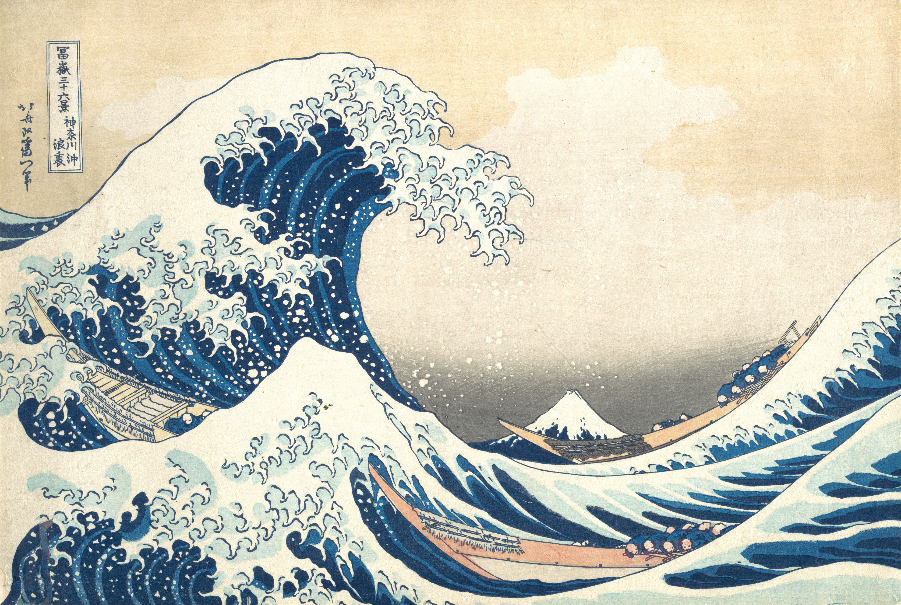

KARIZER
========

Transforming raster images into character images

Features
------------

Original sample image:

Transformed sample image:

(view as [HTML](https://raw.githubusercontent.com/kinoubenkyou/karizer/master/sample/sample-transformed) file)
